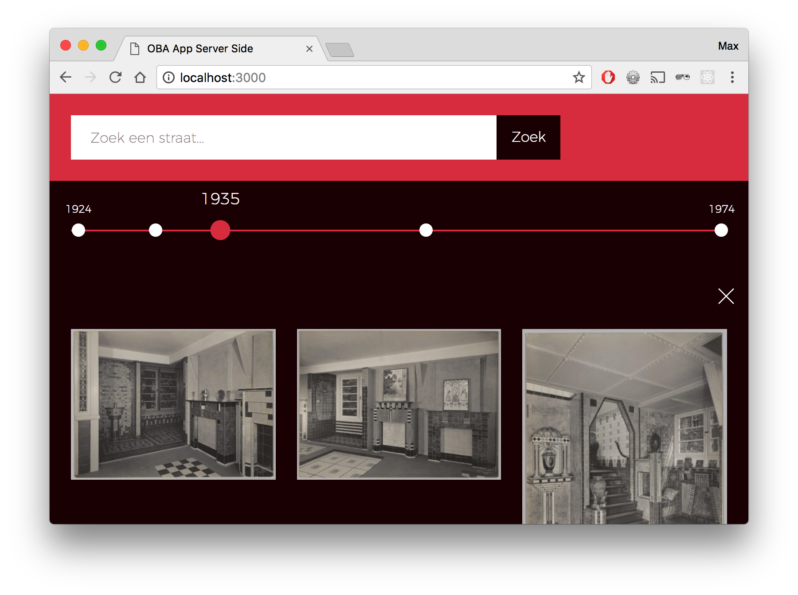
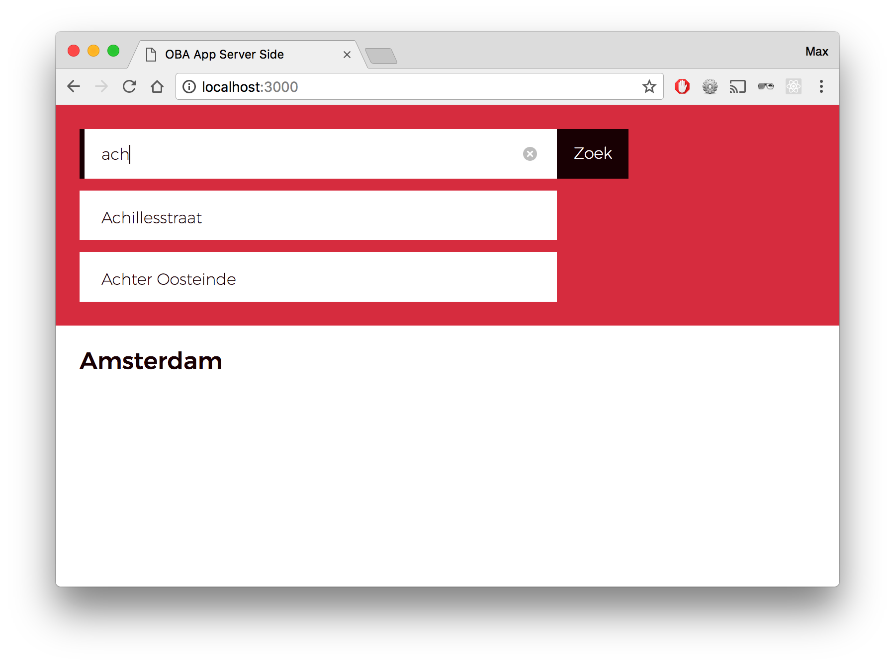
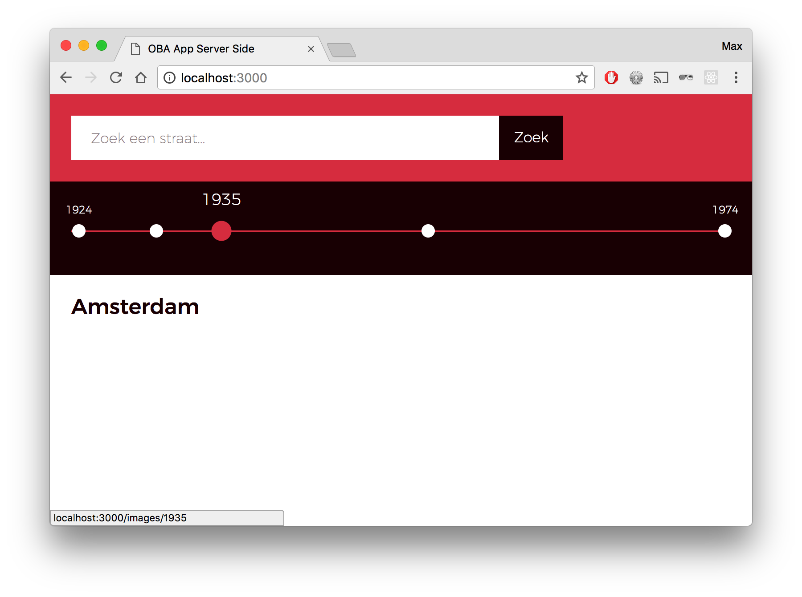
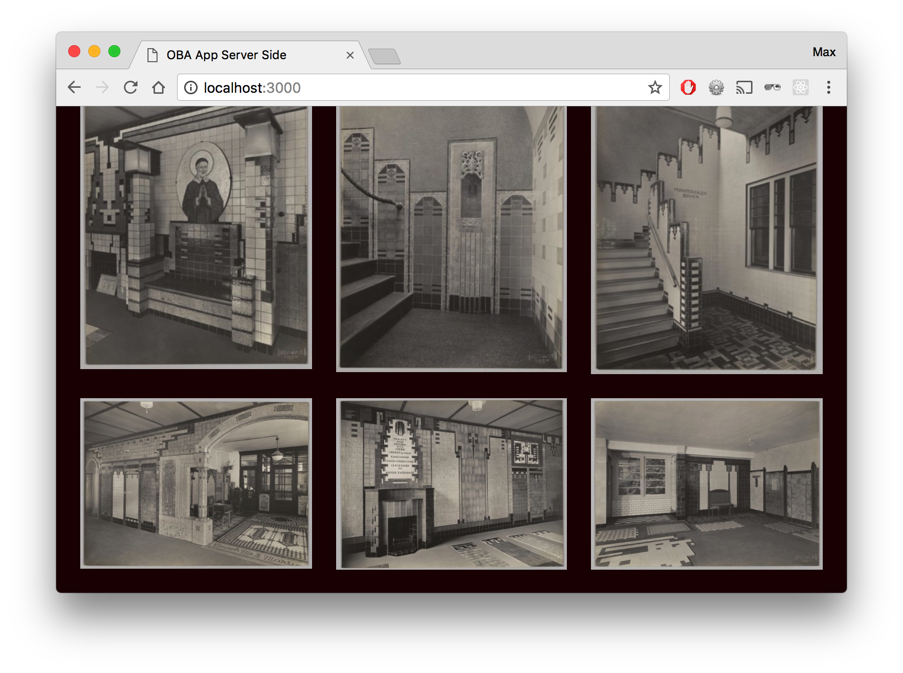
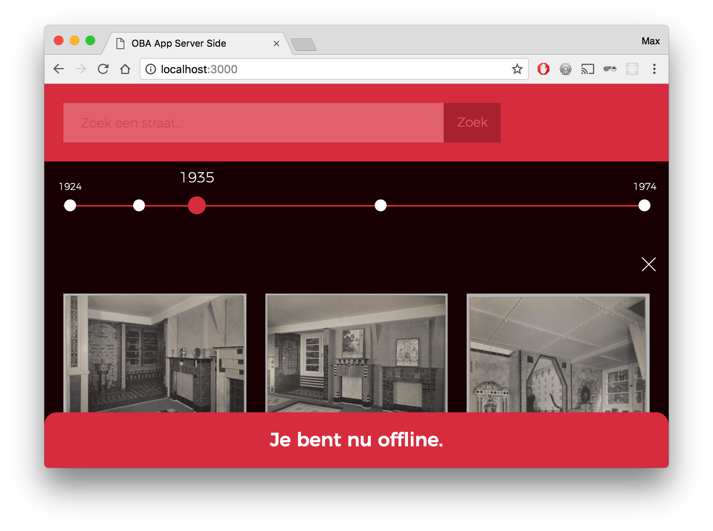
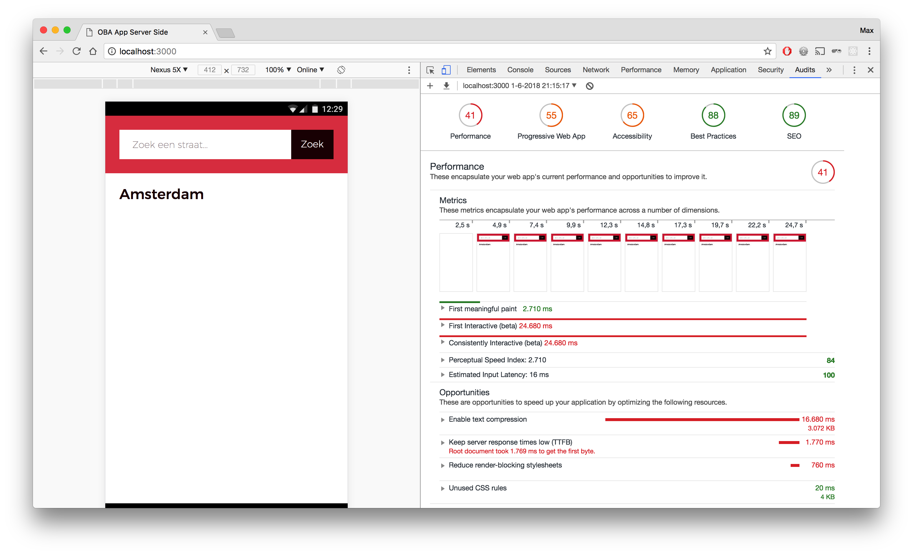
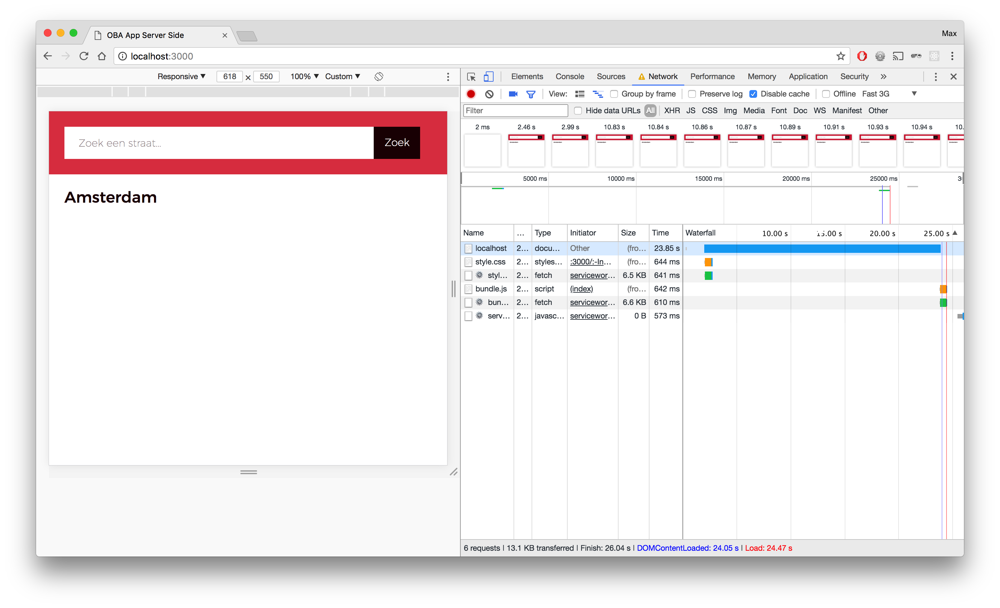
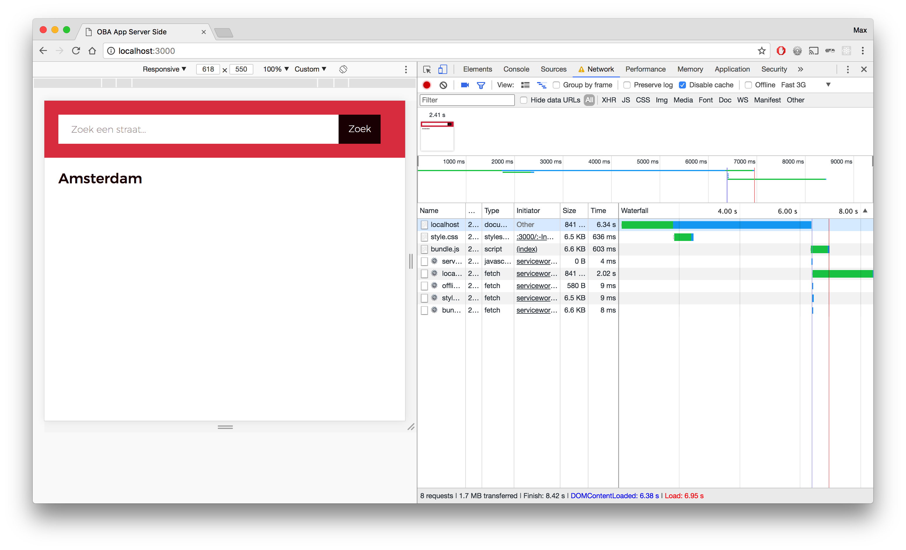
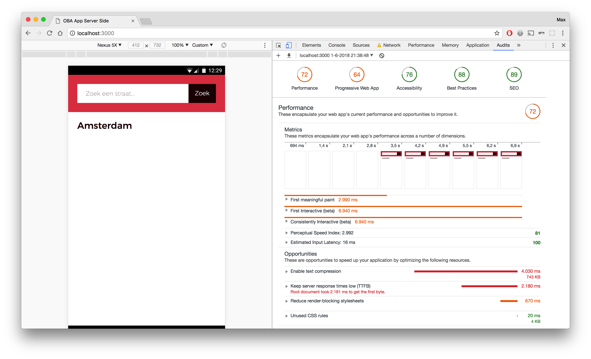

# OBA App Server Side



[Live Demo](https://oba-server-side-woaykgcayj.now.sh/)

This is a web app, created for the [Openbare Bibliotheek Amsterdam](https://www.oba.nl), that shows images from all the streets located in Amsterdam, sorted by year. The images are taken from the Amsterdam city archives and they show how each street has evolved over time.

## Table of Contents

* [Frameworks and packages](#frameworks-and-packages)
* [Installation](#installation)
* [Getting started](#getting-started)
* [Data](#data)
* [Features](#features)
* [Usage](#usage)
* [Audit](#audit)
* [Credits](#credits)

## Frameworks and packages

The app has been build using the following frameworks and npm packages:

* [Browserify](http://browserify.org/)
* [Dotenv](https://www.npmjs.com/package/dotenv)
* [Express JS](https://expressjs.com/)
* [Nodemon](https://nodemon.io/)
* [Pug JS](https://pugjs.org/)
* [Request](https://github.com/request/request)
* [Watchify](https://github.com/browserify/watchify)

## Installation

In order to run the server for yourself locally, `git clone` this repository (https://github.com/vriesm060/performance-matters-server-side), `cd` to the directory in your terminal and install the packages using `npm install`. Next you need to run `npm run build` to build the `bundle.js` file, located in the `dist` directory.

## Getting Started

Before you start the app, you need to create a `vars.env` file in the root directory where you store the port you would like to run the app on, for example `PORT=3000`. After you have done that, you can enter `npm start` in your terminal and the app will start on the port you chose.

## Data

The data comes from [AdamNet](http://www.adamnet.nl/) and gets fetched using Sparql queries.

A snippet of a Sparql query:
```
var query = `
	PREFIX rdf: <http://www.w3.org/1999/02/22-rdf-syntax-ns#>
	PREFIX rdfs: <http://www.w3.org/2000/01/rdf-schema#>
	PREFIX hg: <http://rdf.histograph.io/>
	PREFIX geo: <http://www.opengis.net/ont/geosparql#>
	PREFIX geof: <http://www.opengis.net/def/function/geosparql/>

	SELECT ?street ?name ?wkt WHERE {
		?street a hg:Street .
		?street rdfs:label ?name .
		?street geo:hasGeometry ?geo .
		?geo geo:asWKT ?wkt .
	}
`;
```

After fetching, the data gets cleaned by mapping the data that is needed and leaving the rest alone:

```
return {
	'type': 'Feature',
	'properties': {
		'streetName': row.name.value,
		'link': link,
		'slug': slug,
		'id': id
	},
	'geometry': parseMultiLineString(row.wkt.value)
};
```

## Features

The app has the following features:

* [x] Search for any street in Amsterdam
* [x] Timeline of all the years that have images from a chosen street
* [x] All the images of a street per year
* [x] Sparql queries
* [x] Geometry info that can be drawn on a map for every street
* [x] Server side API requests
* [x] Being able to run the app without any client side JS
* [x] Service Worker for offline accessibility
* [ ] An interactive map of Amsterdam

## Usage

### Searching
---

When you start the app, the data from all the streets is loaded in and you can search for one using the searchbar. Searching can be done both server side and client side. When JS is turned on, the searchbar features autocomplete to make it easier for you.



When JS is turned off, however, this feature is not accessible. But no worry, you can still search server side by submitting the form.

### Timeline
---

After you have found the street you where looking for, a timeline appears. The white dots represent a year in which there are recordings of this street.



### Images
---

When you click on one of the years, all the images that are available from that year appear, for you to enjoy!



### Service Worker
---

There is a Service Worker installed, that lets you keep using the website, even when there is no internet available. The browser caches the latest page for you, so you can still use this page when you're offline. The images that you recently opened are still available. Only the ones that you haven't opened yet are unreachable. The app will tell you when you're offline.



## Audit

All the audits where done on a Fast 3G internet connection, which was good enough to check the app's performance on.

### Adding Browserify
---

With no Browserify installed, all the client side JS in one script file and no server side modules used, these were the stats:

| First meaningful paint | First interactive | Score  |
| ---------------------- | ----------------- | ------ |
| 2.710 seconds          | 24.680 seconds    | 41/100 |

**Before:**


**Audit before:**


After installing Browserify and bundling all the client side JS files, these were the stats:

| First meaningful paint | First interactive  | Score  |
| ---------------------- | ------------------ | ------ |
| 2.400 seconds          | 24.670 seconds     | 43/100 |
| **-0.310 seconds**     | **-0.010 seconds** | **+2** |

The changes weren't significant, but it decreased a little of the loading time and got a slightly better score from the audit.

**After:**


**Audit after:**


### Adding server side modules
---

With no Browserify installed, all the client side JS in one script file and no server side modules used, these were the stats:

| First meaningful paint | First interactive | Score  |
| ---------------------- | ----------------- | ------ |
| 2.710 seconds          | 24.680 seconds    | 41/100 |

**Before:**


**Audit before:**


After all the server side files were also put into modules, just like the client side JS files using Browserify, these were the stats:

| First meaningful paint | First interactive   | Score   |
| ---------------------- | ------------------- | ------- |
| 2.990 seconds          | 6.940 seconds       | 72/100  |
| **+0.280 seconds**     | **-17.740 seconds** | **+31** |

This did the trick! Even though the time it took for the First meaningful paint to load increased, the overall loading time decreased with almost 18 seconds! :open_mouth: And the audit score got up by 31 points, to a nice 72/100.

**After:**


**Audit after:**


## Credits

Credits goes out to [OBA](https://www.oba.nl), who initialized this project and [AdamNet](http://www.adamnet.nl/), for providing the data.
